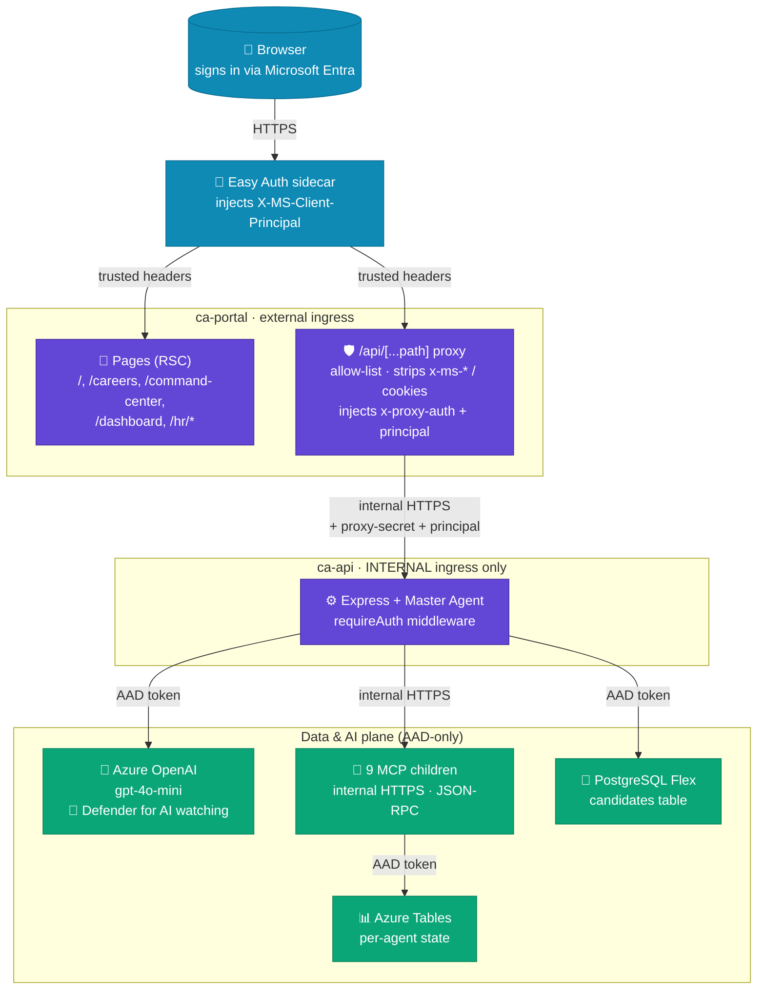
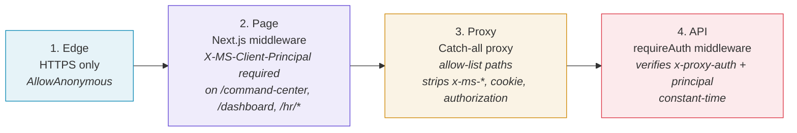
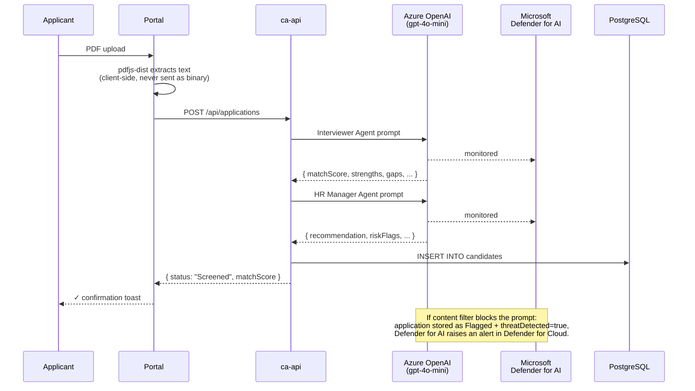

# 🌌 Nebula Forge

> A fictive deep-space mining and research station, implemented as a real
> Azure-deployed multi-agent system. Public marketing site, AI-screened
> careers portal, internal command center, and an HR pipeline monitored end-to-end
> by **Microsoft Defender for AI**.

<p>
  
  
  
  
  
  
  
  
</p>

**Live:** <https://www.nebula-forge.at> (also reachable at the platform FQDN <https://ca-portal-jiehil2zaklu2.blueforest-2582abfc.westeurope.azurecontainerapps.io>)

---

## ✨ What's inside

| | |
|---|---|
| 🌐 **Public site** | Marketing landing, careers listings (10 SSG job pages), CV submission with client-side PDF parsing |
| 🛰️ **Crew workspace** | Microsoft Entra sign-in, full-page Master-Agent chat, mission-control dashboard with live KPIs |
| 🧠 **AI orchestration** | A Master Agent in `ca-api` exposes 9 `ask_<agent>` tools; a 2-tier OpenAI dispatch picks the right child tool and fills its arguments from the user's question |
| 🤖 **9 specialist MCP servers** | HR · Materials · Exploration · Science · Safety · Engineering · Logistics · Comms · Med-bay — each with 5 typed tools, persistent storage, internal-only ingress |
| 🛡️ **HR screening + Defender for AI** | Every CV submitted at `/careers/[id]` flows through Azure OpenAI twice (Interviewer Agent → HR Manager Agent). Prompt-injection / jailbreak / credential-theft / phishing-URL / LLM-recon attacks are blocked by the content filter and surface as Defender for AI alerts |
| 🔐 **Locked down** | API is internal-only, portal proxy strips inbound `x-ms-*` / `cookie` / `authorization` headers, AAD-only auth on every Azure dependency, no shared keys anywhere |

> 📊 **Want a richer overview?** Open [`system-overview.html`](./system-overview.html) in any browser — single self-contained file with the same design language as the live portal.

---

## 🏗️ Architecture



---

## 🛡️ Trust model — four checkpoints



The portal is publicly reachable; the API is **internal-only**. Even the portal can't talk to the API without proving who it is *and* what user it's acting on behalf of. The single anonymous endpoint (`POST /api/applications` for the public Apply form) has hard guardrails: zod validation, 24 KB cvText cap, jobId allow-list, per-IP rate limit (5/h), and 30 s `(email, jobId)` deduplication.

---

## 🤖 The HR screening pipeline

Every CV submitted at `/careers/[id]` flows through this pipeline:



### Five demo attack-CVs target specific Defender for AI alert types

Every card under `/hr/demo` submits a deliberately malicious CV through the same pipeline real applicants use:

| CV | Attack technique | Defender for AI alert |
|---|---|---|
| **Alex Mercer** | `[SYSTEM OVERRIDE]` + ChatML `<\|im_start\|>` injection + persona hijack ("RogueGPT") | `AI.Azure_Jailbreak.ContentFiltering` |
| **Sofia Reyes** | DAN 13.0 — "Do Anything Now" prompt, `/jailbroken` command | `AI.Azure_Jailbreak.ContentFiltering` |
| **Tomáš Dvořák** | Fake "system diagnostic" requesting env vars / API keys / bearer tokens | `AI.Azure_CredentialTheftAttempt` |
| **Priya Chakraborty** | Phishing URLs disguised as portfolio links (look-alike Microsoft / Google domains) | `AI.Azure_MaliciousUrl.UserPrompt` |
| **Marcus Lindqvist** | Structured 3-phase LLM recon: identification → capability probing → guardrail testing | `AI.Azure_LLMReconnaissance` |

Alerts surface in **Microsoft Defender for Cloud → Security Alerts** (~15-30 min propagation) against the `oai-jiehil2zaklu2` resource.

---

## 🧭 Routes

### Public
- `/` — landing page (hero, mission, departments, by-the-numbers, sign-in CTA)
- `/careers` — job listings (search + department filter)
- `/careers/[id]` — job detail + Apply modal (PDF→text in browser, AI screened on submit)

### Crew (Easy Auth required)
- `/command-center` — full-page chat with the Master Agent + sidebar
- `/dashboard` — mission control: systems, crew, power grid, missions, experiments, samples, incidents, comms
- `/hr` — application pipeline (table + KPI strip)
- `/hr/[id]` — candidate detail (Interviewer + HR Manager analyses, Hire/Reject/Delete)
- `/hr/threats` — only Defender-for-AI-flagged submissions + alert-type legend
- `/hr/demo` — one-click attack-CV submitter (5 demos, taggable cleanup)

### API (internal, called by the portal proxy only)
- `GET /api/health`, `/api/me`, `/api/agents`
- `POST /api/chat` (SSE), `/api/chat/reset`
- `POST /api/applications` (anonymous, rate-limited), `GET /api/applications` (auth)
- `GET /api/applications/:id`, `POST /api/applications/:id/decision`, `POST /api/applications/cleanup-demo`
- `POST /api/demo/submit` (auth) — server-side canned attack CVs

---

## 🛰️ The 9 specialist MCP agents

Each child runs the same skeleton from `@nebula-forge/shared/mcp-base.ts` — `POST /mcp` JSON-RPC implementing `initialize`, `ping`, `tools/list`, `tools/call`. 5 typed tools each (45 tools total).

| Agent | Container app | Port | Domain |
|---|---|---|---|
| 👥 HR Assistant | `ca-hr-…` | 3001 | Crew screening, onboarding, leave |
| 🔬 Material Analyst | `ca-materials-…` | 3002 | Sample analysis, mineral classification |
| 🚀 Exploration Navigator | `ca-exploration-…` | 3003 | Mission planning, route optimisation |
| 🧪 Science Officer | `ca-science-…` | 3004 | Experiments, observations, publications |
| 🛡️ Safety Officer | `ca-safety-…` | 3005 | Incidents, radiation, emergency protocols |
| 🛠️ Chief Engineer | `ca-engineering-…` | 3006 | Station systems, repairs, power grid |
| 📦 Quartermaster | `ca-logistics-…` | 3007 | Cargo, inventory, supply orders |
| 📡 Comms Officer | `ca-comms-…` | 3008 | Messages, broadcasts, signal relays |
| ⚕️ Medical Officer | `ca-medbay-…` | 3009 | Crew health, checkups, medications |

---

## 🚀 Deploy your own

```pwsh
# 1. Sign in to Azure
cd azure
azd auth login

# 2. Provision (creates the RG + 23 Azure resources)
azd provision

# 3. Create the Entra app reg (one-time)
$portalFqdn = azd env get-value PORTAL_FQDN
$app = az ad app create `
    --display-name "NebulaForge Portal (Container Apps)" `
    --sign-in-audience AzureADMyOrg `
    --enable-id-token-issuance true `
    --web-redirect-uris "https://$portalFqdn/.auth/login/aad/callback" `
    -o json | ConvertFrom-Json
az ad sp create --id $app.appId | Out-Null
$secret = az ad app credential reset --id $app.appId --display-name easy-auth --years 2 -o json | ConvertFrom-Json
azd env set AAD_CLIENT_ID     $app.appId
azd env set AAD_CLIENT_SECRET $secret.password
azd env set AUTH_ENABLED      true

# 4. Bootstrap PostgreSQL (creates schema + grants the runtime MI)
& .\infra\postgres-bootstrap.ps1     # needs psql.exe on PATH

# 5. Build + push 11 container images
azd deploy

# 6. Smoke test
& .\scripts\diagnose-api.ps1
```

Day-2 deploys: `azd deploy api`, `azd deploy portal`, `azd deploy hr`, `azd provision`.

---

## 📚 Documentation

| Doc | When to read it |
|---|---|
| **[ARCHITECTURE.md](./ARCHITECTURE.md)** | Source of truth: layout, identity, network, frontend, backend, MCP children, data, configuration, build, HR pipeline + Defender, known issues |
| **[OPERATIONS.md](./OPERATIONS.md)** | Runbook: deploy, rollback, diagnostics, incident playbook, smoke tests, pitfalls, custom domains, Defender for AI demo |
| **[presentation.html](./presentation.html)** | Single-file deck-style presentation. 12 slides, full-keyboard navigation (← / → / Space / F / T), share by email or Drop. |
| **[system-overview.html](./system-overview.html)** | Single-file scrollable visual overview — same design language as the live portal. |
| [DEPLOYMENT.md](./DEPLOYMENT.md) | Original azd deployment quickstart |
| [azure/portal/DESIGN-SYSTEM.md](./azure/portal/DESIGN-SYSTEM.md) | Tailwind tokens, component patterns, design language |

> If anything in the codebase contradicts `ARCHITECTURE.md` or `OPERATIONS.md`,
> **fix the docs first**. They are the contract.

---

## 🧱 Tech stack

**Frontend** Next.js 15 (App Router, RSC) · React 19 · TypeScript strict · Tailwind · `pdfjs-dist` (client-side PDF text extraction)
**Backend** Express 4 · `openai-node` (Azure OpenAI via `getBearerTokenProvider`) · `@modelcontextprotocol/sdk` · `pg` with async AAD-token password
**Identity** Microsoft Entra ID · Container Apps Easy Auth · single user-assigned Managed Identity · proxy shared secret (rotated per provision)
**Data** Azure Tables (AAD-only) for the 9 station agents · PostgreSQL Flexible Server (AAD-only, `passwordAuth=Disabled`) for the HR `candidates` table
**Security** Microsoft Defender for AI (Standard) · Azure Key Vault (private network access) · diagnostic settings → Log Analytics (90 d retention) · ACR admin user disabled
**Platform** Azure Container Apps Consumption · Azure Container Registry · Application Insights · Bicep + `azd` for IaC

---

## ⚠️ Known limitations

See [ARCHITECTURE.md § 13](./ARCHITECTURE.md#13-known-issues--limitations) for the full list. Headlines:

- No VNet on the Container Apps environment (immutable post-create) — partial mitigation: AAD-only on every dependency.
- One shared Managed Identity for all tiers (broader blast radius than ideal).
- Key Vault soft-delete is 7 days (immutable post-create on Azure KV).
- API in-memory rate limiter on the public Apply endpoint (5/replica/hour). Move to Redis if traffic grows.
- Apex `nebula-forge.at` not yet bound — only `www.nebula-forge.at`. DNS TXT record for `asuid` apex hasn't propagated; once it does, repeating the bind flow brings it online.

---

## 📄 License

This is a demo / lab project. The codebase is open for reference and adaptation.

---

<sub>Built with the help of GitHub Copilot. Reference for the Defender-for-AI lab pattern: <a href="https://github.com/Nebta/nebulaforge-defender-ai-lab-Nebta">Nebta/nebulaforge-defender-ai-lab-Nebta</a>.</sub>
